# Social-Network_API

 # Badges: 
  

  # GitHub username: moniquemeas
    
  # Table of Contents
  * [Description](#description)
  * [Usage](#usage)
  * [Installation](#installation)
  * [Technology](#technoloy)
  * [Contributing](#contributing)
  * [License](#license)
  * [Contact](#contact)

  # Description:
  This application is an API for social network web application where users can share their thoughts, react to friends’ thoughts, and create a friend list.

  # Usage
  - User is able to create a user with username and email.

  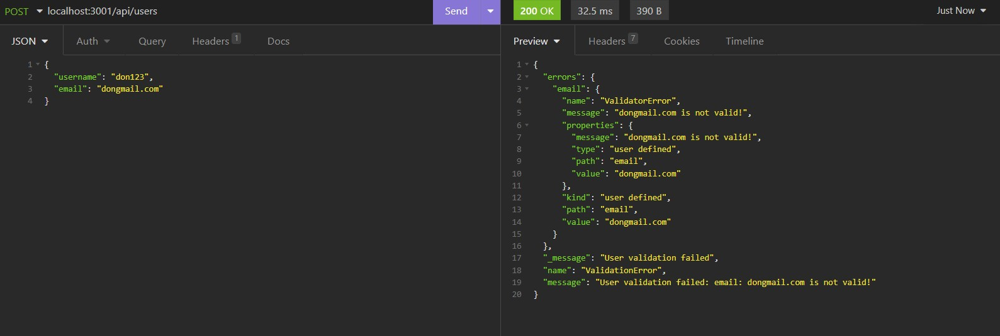

  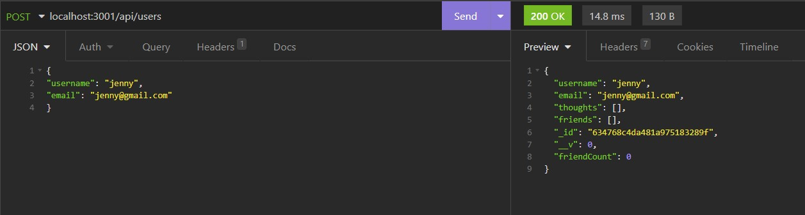

  - User is get a user by Id.

  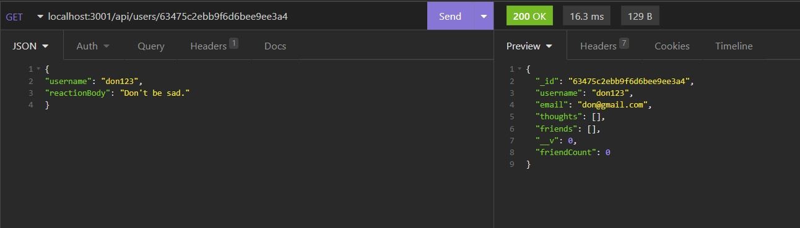

  - User is able to get all users.

  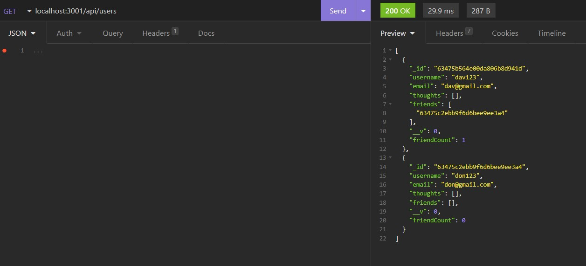

  - User is able to update and delete user.

  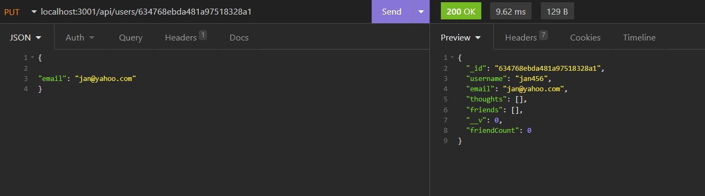

  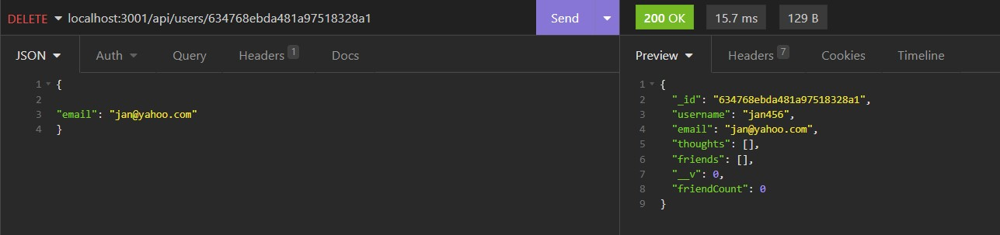

  - User is able to create friend and delete friend.

  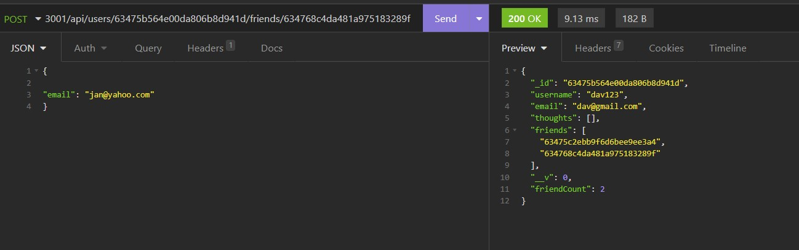

  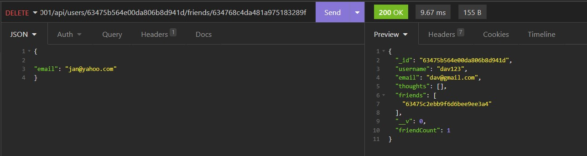

  - User is able to create, read, update and delete thoughts.

  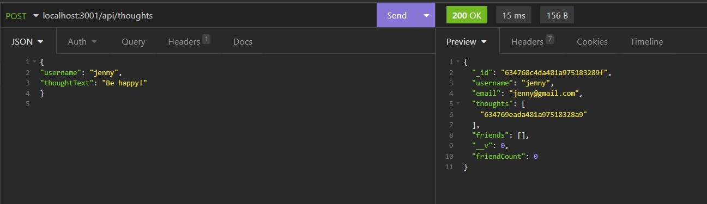

  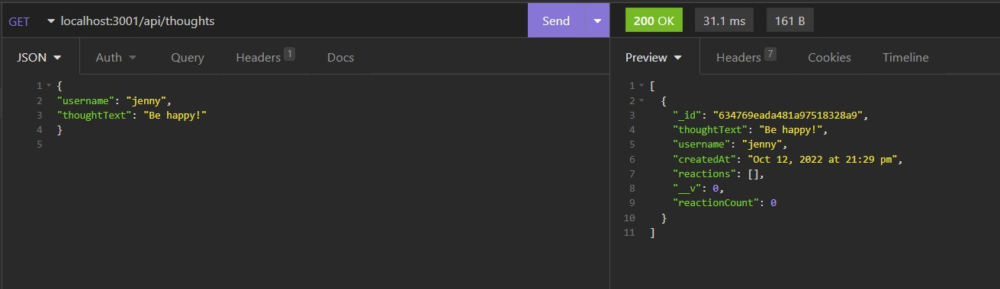

  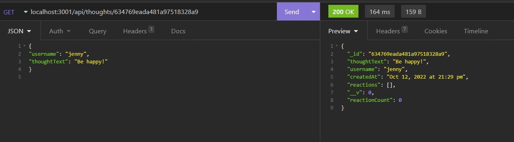

  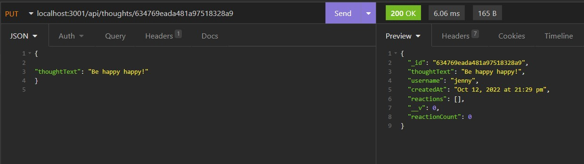

  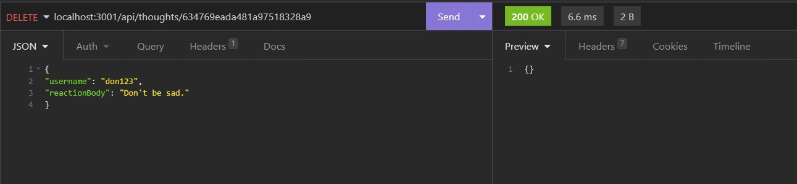

  - User is able to create reaction to a thought and delete reaction.

  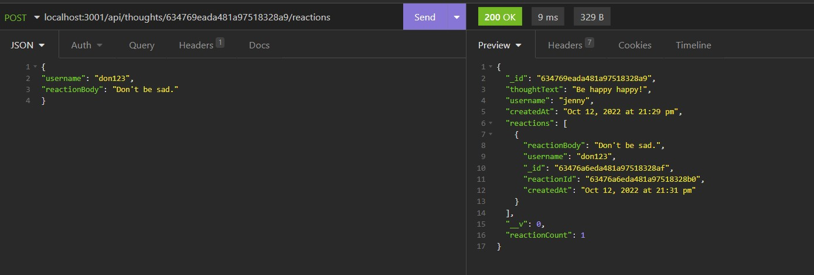

  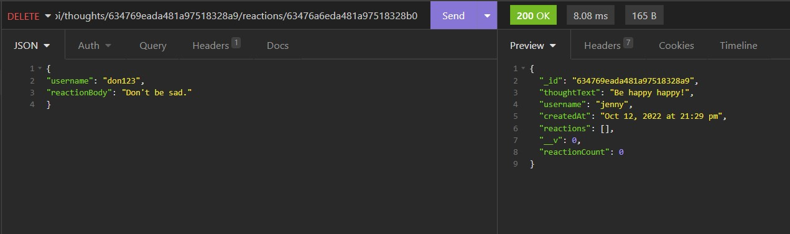

    
  # Installation
  - Clone the repository from Github.
  - Install Node.js
  - Install MongoDB
  - npm install express, moment and mongoose

  # Technology:

  * JavaScript
  * Node.js
  * MongoDB
  * express.js 
  * moment.js 
  * mongoose

  # Walk through video Demo
  
  
 
  
  # Contributing:
  Monique Meas
    
  # License:
  * MIT
  * To find out more about MIT go to:
  * https://opensource.org/licenses/MIT
    
  # Contact:
  monique.meas@gmail.com